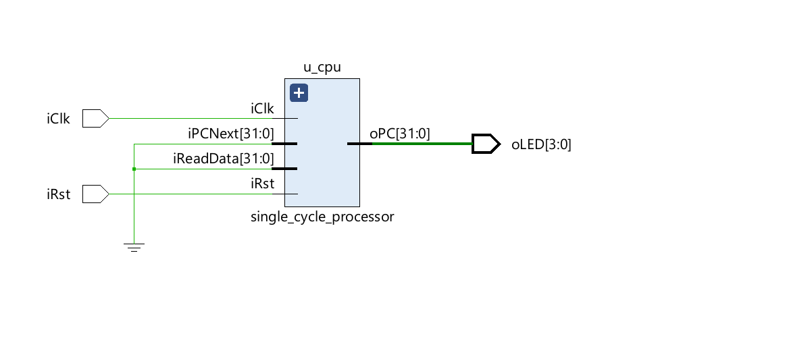

# Vibi's RISC-V

## Tools / Versioning

- Vivado 2025.2  
- Digilent Cmod S7 (Spartan-7 FPGA)  
- Digilent USB/JTAG Drivers  

---

## Overview

This project implements a **32-bit single-cycle RISC-V processor** in VHDL targeting a Spartan-7 FPGA (Cmod S7). The processor executes one instruction per clock cycle and follows a Harvard-style architecture with separate instruction and data memory.

---

## Architecture Diagrams

### Top-Level / System


### Datapath + Control


### Full Schematic


> If images do not render, ensure they are `.png` and located in the `docs/` folder.

---

## Core Characteristics

| Feature | Description |
|--------|------------|
| Architecture | Single-cycle |
| ISA | Partial RV32I |
| Word size | 32-bit |
| Registers | 32 (x0–x31) |
| x0 | Hardwired to 0 |
| Instruction width | 32-bit |
| Addressing | Byte-addressed, word-aligned |
| Execution | 1 instruction per cycle |

---

## Instruction Support

### R-Type Instructions

| Instruction | Operation |
|------------|----------|
| add | Addition |
| sub | Subtraction |
| and | Bitwise AND |
| or  | Bitwise OR |
| xor | Bitwise XOR |
| sll | Shift left logical |
| srl | Shift right logical |
| sra | Shift right arithmetic |
| slt | Signed comparison |
| sltu | Unsigned comparison |

---

### I-Type Instructions

| Instruction | Operation |
|------------|----------|
| addi | Add immediate |
| andi | AND immediate |
| ori  | OR immediate |
| xori | XOR immediate |
| slti | Signed compare |
| sltiu | Unsigned compare |

---

### Memory Instructions

| Instruction | Description |
|------------|-------------|
| lw | Load word |
| sw | Store word |

---

### Control Flow

| Instruction | Description |
|------------|-------------|
| beq | Branch if equal |
| bne | Branch if not equal |
| blt | Branch if less than |
| bge | Branch if greater/equal |
| jal | Jump and link |
| jalr | Jump and link register |

---

### Upper Immediate

| Instruction | Description |
|------------|-------------|
| lui | Load upper immediate |
| auipc | Add upper immediate to PC |

---

## Datapath Components

| Component | Description |
|----------|------------|
| Program Counter | Tracks instruction address |
| Instruction Memory | ROM storing program |
| Register File | 32 registers |
| ALU | Arithmetic/logic operations |
| Immediate Generator | Instruction decoding |
| Data Memory | RAM for loads/stores |
| Control Unit | Generates control signals |

---

## Memory System

| Memory | Size | Type |
|-------|-----|------|
| Instruction Memory | 4 KB | ROM |
| Data Memory | 4 KB | RAM |

---

## Addressing

| Feature | Description |
|--------|------------|
| Addressing | Byte-addressed |
| Alignment | Word-aligned |
| Indexing | address(11 downto 2) |

---

## Assembler Usage

This project includes a custom Python assembler:

- Script: `main.py`  
- Input: `genInstr.s`  
- Output: VHDL ROM initialization  

---

### Step 1 — Write Program

Edit:

```
genInstr.s
```

Example:

```
start:
    addi x1, x0, 5
    addi x2, x0, 10
    add  x3, x1, x2
    sw   x3, 0(x0)
    lw   x4, 0(x0)

loop:
    jal x0, loop
```

---

### Step 2 — Run Assembler

```
python main.py genInstr.s --format vhdl -o rom_init.txt
```

---

### Step 3 — Load Into Instruction Memory

Replace ROM contents in your VHDL:

```
constant ROM : t_imem := (
    -- paste rom_init.txt contents here
    others => x"00000013"
);
```

---

### Step 4 — Build FPGA Bitstream

Run in Vivado:

- Synthesis  
- Implementation  
- Generate Bitstream  

---

### Step 5 — Program the Board

- Open Hardware Manager  
- Connect to Cmod S7  
- Program device with `.bit` file  

---

## Execution Workflow

```
Assembly (genInstr.s)
→ Python Assembler (main.py)
→ Machine Code (rom_init.txt)
→ Instruction Memory (VHDL)
→ CPU Execution on FPGA
→ Output (LEDs / signals)
```

---

## Expected Behavior on FPGA

### Sequential Execution
- LEDs change continuously  
- Represents PC incrementing  

### Infinite Loop

```
loop:
    jal x0, loop
```

- LEDs freeze or repeat  

### Arithmetic Result

If LEDs map to ALU output:
- Example result 15 → LEDs show `1111`  

---

## System Classification

Single-cycle CPU with local instruction and data memory  

---

## Summary

- Functional RV32I single-cycle processor  
- Custom Python assembler integrated  
- Executes programs on FPGA  
- Observable via LEDs  
- Ready for SoC expansion  
